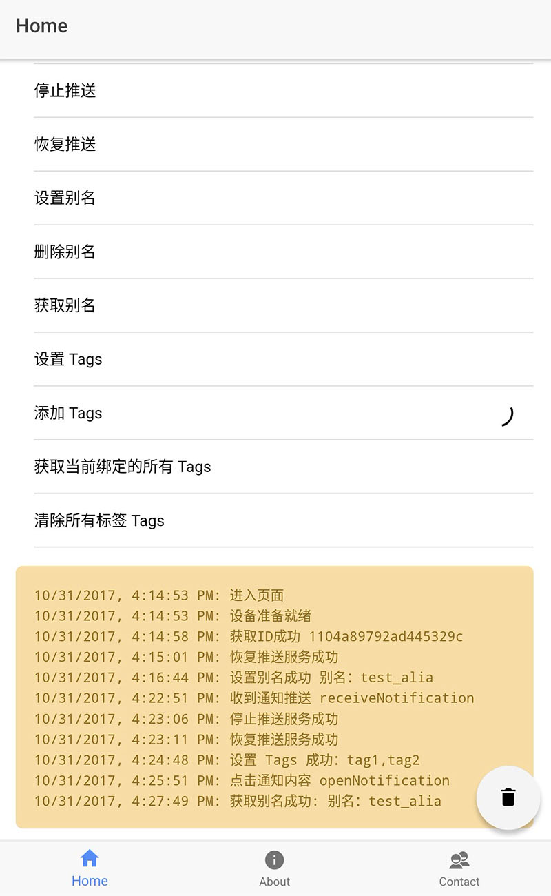

# ionic2-JPush


[](https://david-dm.org/HsuanXyz/ionic2-jpush)
[![NPM version][npm-image]][npm-url] [![Downloads][downloads-image]][downloads-url] [![MIT License][license-image]][license-url]

为ionic2调用极光插件提供符合angular2及TS的调用方式

说在前面：如果想使用 ionic-native 的调用方式，可以参考https://github.com/zjcboy/ionic2-jpush-demo

### install
先安装官方的cordova插件 https://github.com/jpush/jpush-phonegap-plugin.git

`$ cordova plugin add jpush-phonegap-plugin --variable APP_KEY=your_jpush_appkey`

在安装本库

`$ npm install ionic2-jpush --save`


### Import module

```typescript
import { NgModule, ErrorHandler } from '@angular/core';
import { IonicApp, IonicModule, IonicErrorHandler } from 'ionic-angular';
import { MyApp } from './app.component';
...
import { IonJPushModule } from 'ionic2-jpush'

@NgModule({
  declarations: [
    MyApp,
    ...
  ],
  imports: [
    IonJPushModule,
    IonicModule.forRoot(MyApp)
  ],
  bootstrap: [IonicApp],
  entryComponents: [
    MyApp,
    ...
  ],
  providers: [{provide: ErrorHandler, useClass: IonicErrorHandler}]
})
export class AppModule {}

```

### Use

```typescript
import 'rxjs';
import { Component } from '@angular/core';
import { Platform } from 'ionic-angular';
...
import { JPushService } from 'ionic2-jpush'

@Component({
  templateUrl: 'plugins-test.html'

})
export class PluginsTestPage {
  constructor(
    private platform: Platform,
    private jPushPlugin: JPushService
  ) {

        platform.ready().then( () =>{
       
             this.jPushPlugin.openNotification()
               .subscribe( res => {
                 console.log('收到推送');
                 console.log(res)
               });
       
             this.jPushPlugin.receiveNotification()
               .subscribe( res => {
                 console.log('收到推送');
                 console.log(res)
               });
       
             this.jPushPlugin.receiveMessage()
               .subscribe( res => {
                 console.log('收到推送');
                 console.log(res)
               });
       
           })

     }

    /**
    * 注册极光
    */
   init() {
    this.jPushPlugin.init()
    .then(res => alert(res))
    .catch(err => alert(err))
    }

    /**
    * 获取ID
    */
    getRegistrationID() {
     this.jPushPlugin.getRegistrationID()
     .then(res => alert(res))
     .catch(err => alert(err))
     }
     
    /**
    * 设置标签
    */
    setTags() {
    this.jPushPlugin.setTags({
      sequence: Date.now(),
      tags: ['tag1', 'tag2']
    })
    .then((res:any) => {
      console.log(res.tags.toString())
    })
    .catch(err => {
      alert(err);
      console.log(err)
    })
    }
    
  }

```

# API
| 名称          |  参数 | 返回类型   | 描述 |
| ------------- | ------- | ------- | ----------- |
| setDebugMode  | boolean | Promise | 设置 debug 模式   |
| init          | 无 | Promise | 注册极光   |
| getRegistrationID       | 无 | Promise | 获取ID  |
| stopPush      | 无 | Promise | 停用推送          |
| resumePush    | 无 | Promise | 恢复推送          |
| isPushStopped | 无 | Promise | 推送是否被停用     |
| setTags | { sequence: number; tags: string[] }| Promise | 设置 tags |
| addTags | { sequence: number; tags: string[] }| Promise | 添加 tags |
| deleteTags | { sequence: number; tags: string[] }| Promise | 删除 tags |
| cleanTags | { sequence: number }| Promise | 清除tags |
| getAllTags | { sequence: number }| Promise | 获取所有本机设置的 tags |
| setAlias | { sequence: number; alias: string }| Promise | 设置 alias |
| deleteAlias | { sequence: number }| Promise | 删除 alias |
| getAlias | { sequence: number }| Promise |获取本机设置的 alias |

# IOS API
| 名称          |  参数 | 返回类型   | 描述 |
| ------------- | ------- | ------- | ----------- |
| setBadge | value:number| Promise | 设置 badge 至 JPush 服务器|
| reSetBadge | 无| Promise | 移除 JPush 服务器 badge |
| getApplicationIconBadgeNumber | 无| Promise | 获取本地 badge |
| setApplicationIconBadgeNumber | value:number| Promise | 设置本地 badge |
| clearAllLocalNotifications | 无| Promise | 清除所有本地推送对象 |

# Android API
| 名称          |  参数 | 返回类型   | 描述 |
| ------------- | ------- | ------- | ----------- |
| clearNotificationById | id:number| Promise | 清除指定ID通知 |
| clearAllNotification | 无 | Promise | 清除所有通知 |
| setPushTime | days: number , startHour: number, endHour: number | Promise | 设置允许推送时间 |
| setSilenceTime | days: number , startHour: number, endHour: number | Promise | 设置通知静默时间 |

# 可订阅事件
| 名称          |  参数 | 返回类型   | 描述 |
| ------------- | ------- | ------- | ----------- |
| openNotification | 无| Observable | 点击通知事件 |
| receiveNotification | 无| Observable | 收到通知事件 |
| receiveMessage | 无| Observable | 收到自定义消息事件 |
| backgroundNotification | 无| Observable | 后台收到通知事件 |

[npm-url]: https://www.npmjs.com/package/ionic2-jpush
[npm-image]: https://img.shields.io/npm/v/ionic2-jpush.svg

[downloads-image]: https://img.shields.io/npm/dm/ionic2-jpush.svg
[downloads-url]: http://badge.fury.io/js/ionic2-jpush

[license-image]: http://img.shields.io/badge/license-MIT-blue.svg?style=flat
[license-url]: LICENSE
